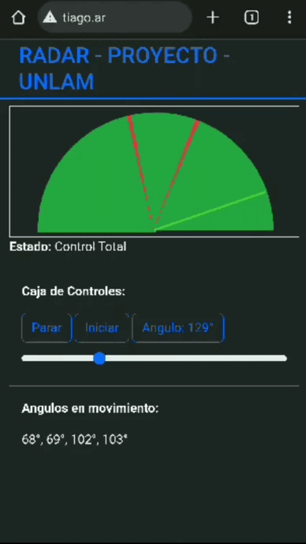

# Proyecto Informatico - UNLAM - Sistemas Embebidos
## Tabla de Contenido

- [Proyecto Informatico - UNLAM - Sistemas Embebidos](#proyecto-informatico---unlam---sistemas-embebidos)
	- [Tabla de Contenido](#tabla-de-contenido)
	- [Idea y Concepto](#idea-y-concepto)
	- [Ordenamiento de Archivos](#ordenamiento-de-archivos)
	- [Topicos](#topicos)
	- [Usuarios y Contraseñas](#usuarios-y-contraseñas)

~~~
git clone https://github.com/Tiago-Pujia/radar-esp32
~~~
---
## Idea y Concepto
El proyecto se centra en un detector de movimiento de 180° grados, diseñado para iniciar, detener o fijar su funcionamiento. 

Hacemo uso de un conjunto de componentes, que incluyen un ultrasonido, un servo, un interruptor (switch), un protoboard, un ESP32 y un chasis de Rasti. Ademas, hemos implementado un [servidor público](tiago.ar) como panel de control(darshboard) y [adafruit](io.adafruit.com) como broker MQTT; Toda la información generada por el proyecto se visualiza en tiempo real en el dashboard.

El circuito se presenta en formato físico y será expuesto la clase del día 1/12/2023.

---
## Ordenamiento de Archivos
El proyecto se desarrollo utilizando conocimientos de MicroPython, HTML, CSS, JavaScript y Bootstrap.

La relación de archivos de la página web incluye:
~~~
index.html 	-> Archivo de inicio y punto de acceso principal.
styles.css 	-> Hoja de estilos adaptable a diversas pantallas.
script.js	-> Lógica de programación implementada en JavaScript.
~~~

La lista de archivos asociados al microcontrolador esta compuesta por:
~~~
microControlador.py	-> Archivo principal del microcontrolador
hcsr04.py			-> Librería para la funcionalidad de ultrasonido, ya incorporada.
~~~

---
## Topicos
El sistema se basa en dos tópicos principales:

1. **radar/recibo_del_esp (radar-slash-recibo-del-esp)**
	- El servidor broker recibe información del microcontrolador ESP32, y el cliente se suscribe a este mismo tópico.
	- La información transmitida en este tópico incluye:
    	- **estado**	-> indica el modo actual del circuito, que puede cambiar entre *Control Total*, *Deshabilitado* y *Control Ángulo Fijo*.
		- **radar**		-> envía al cliente información sobre el movimiento detectado, representado en rojo en el radar en el ángulo correspondiente.
		- **radar_fijo**-> proporciona información sobre el movimiento detectado en un único ángulo.

2. **radar/envio_al_esp (radar-slash-envio-al-esp)**
	- El microcontrolador está suscrito a este tópico y recibe información del broker proveniente del cliente.
	- La información transmitida en este tópico incluye:
		- **estado** -> representa el modo al que debe cambiar el circuito, siendo estos los siguientes:
			- *Control Total*		-> el servo gira de 0° a 180°, verificando si hay movimiento en todos los ángulos.
			- *Control Ángulo Fijo*	-> el servo permanece inmóvil en un ángulo fijo mientras detecta movimiento.
			- *Deshabilitado*		-> tanto el servo como el ultrasonido se desactivan.
---
## Usuarios y Contraseñas
Cada quien que crea su proyecto debe crearse una cuenta en [adafruit](io.adafruit.com), donde debera ingresar usuario y key en los siguientes codigos:

- *microControlador.py*
> 27 - topic_1 = "***USUARIO***/feeds/radar-slash-recibo-del-esp"
>
> 28 - topic_2 = "***USUARIO***/feeds/radar-slash-envio-al-esp"
> 
> 29 - user = '***USUARIO***'
> 
> 30 - password = '***KEY***'

> 38 - ssid = "****WIFI***"
>
> 39 - password = "***CONTRASEÑA***"

- *script.js*
> 66 - topico_recibo = "***USUARIO***/feeds/radar-slash-recibo-del-esp";
>
> 67 - topico_envio = "***USUARIO***/feeds/radar-slash-envio-al-esp";
> 
> 68 - usuario = "***USUARIO***";
> 
> 69 - password = "***KEY***";